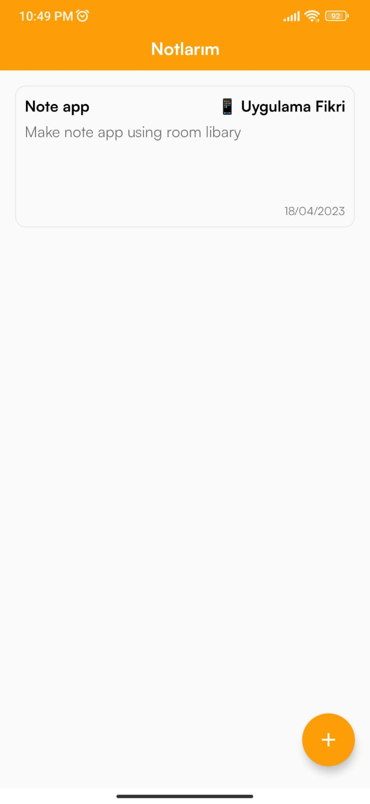
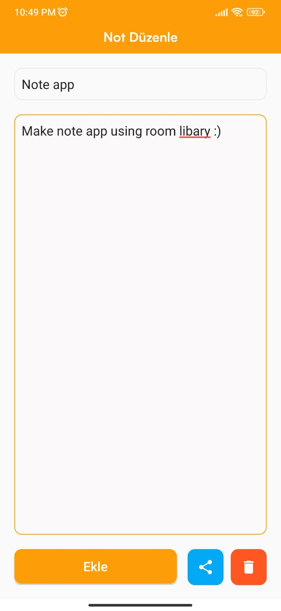
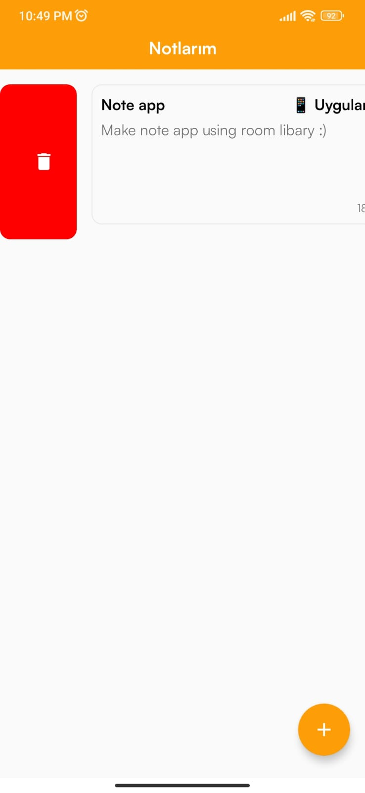
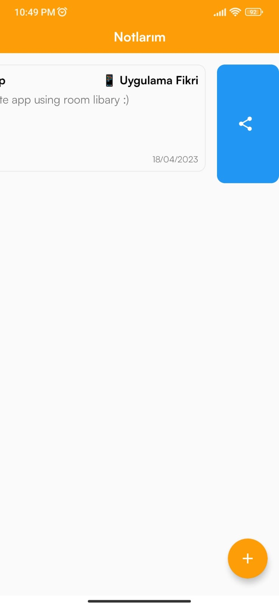

# Note-App

A note-taking app using the Room library.

 ## Tech stack & Open-source libraries
- Minimum SDK level 24
- 100% [Kotlin](https://kotlinlang.org/) based + [Coroutines and LiveData](https://github.com/Kotlin/kotlinx.coroutines)
- [Android Architecture Components](https://developer.android.com/topic/libraries/architecture) - Collection of libraries that help you design robust, testable, and maintainable apps.
  -  A single-activity architecture, using the [Navigation component](https://developer.android.com/guide/navigation/navigation-getting-started) to manage fragment operations.
  - [LiveData](https://developer.android.com/topic/libraries/architecture/livedata) - Data objects that notify views when the underlying database changes.
  - [Lifecycle](https://developer.android.com/topic/libraries/architecture/lifecycle) - perform an action when lifecycle state changes
  - [ViewModel](https://developer.android.com/topic/libraries/architecture/viewmodel) - Stores UI-related data that isn't destroyed on UI changes. 
  - [DataBinding](https://developer.android.com/topic/libraries/data-binding) - Generates a binding class for each XML layout file present in that module and allows you to more easily write code that interacts with views.
  - [Room](https://developer.android.com/topic/libraries/architecture/room) - SQLite object mapping library.
  
   
  
### Package Structure

| Package | 
| ----- | 
||
 
   
  
 ### Screenshots

| Home | Add | Edit |
| ----- | ------------ | ------------ |
||||

  
 
| Swipe Delete | Swipe Share 
| ----- | ------------ |
||

